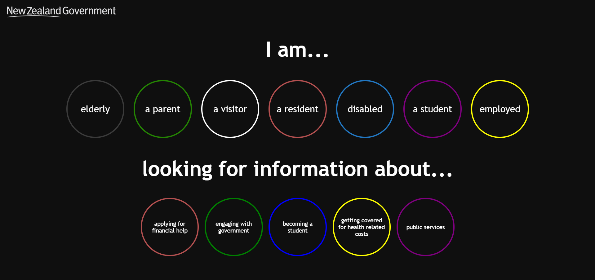

# team-treehouse

**Welcome to Team Treehouse's project for Summer of Tech Weekend Web Challenge 2018!**

Our goal is to **re-imagine government web services** by providing more accessible and intuitive platforms that aim to deliver unique experiences to users from all walks of life.

## Members:

**DESIGNERS**
- Rachel Bolt 
- Ryan Walker

**DEVELOPERS**
- Edi Takutai Rose ([github.com/edi-rose](https://www.github.com/edi-rose))
- Liam Byrne ([github.com/byrneliam2](https://www.github.com/byrneliam2))
- Rodney Cruden-Powell ([github.com/StragglyRodney](https://www.github.com/StragglyRodney))

## What's here?

This repo holds a simple prototype for the platform we came up with, written using React. The event served as a technical learning ground, a way to experience working in a mixed group of designers and developers and also as my first hackfest!